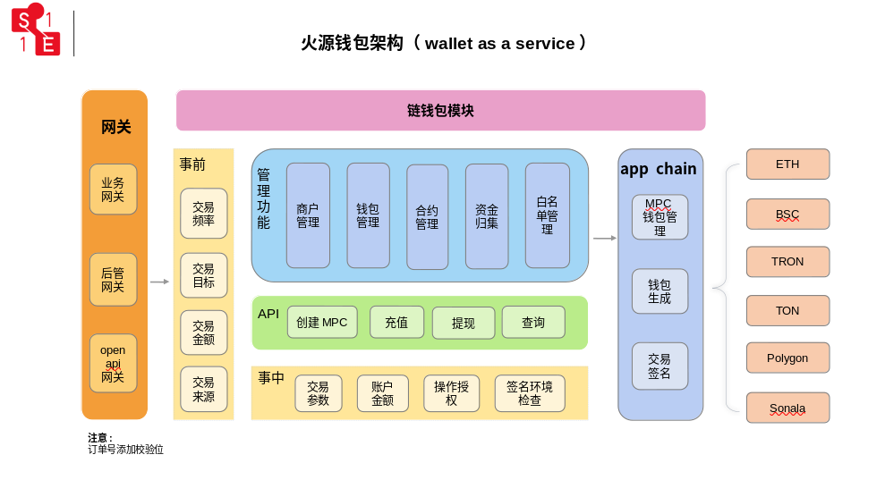
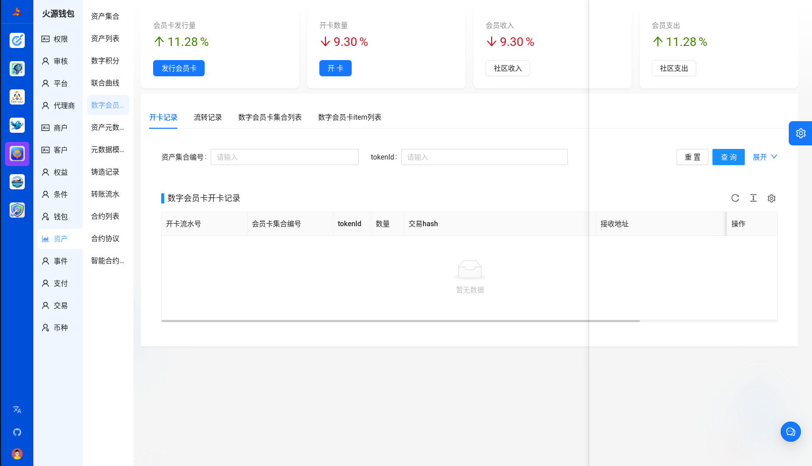
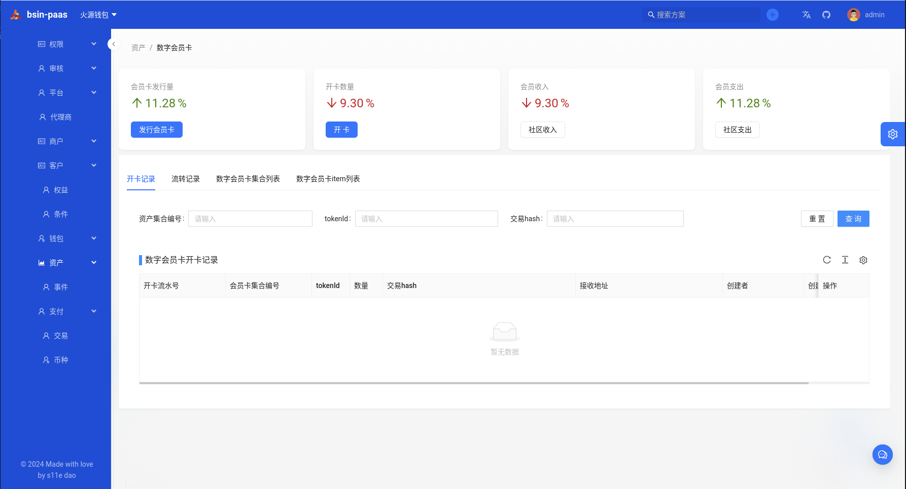
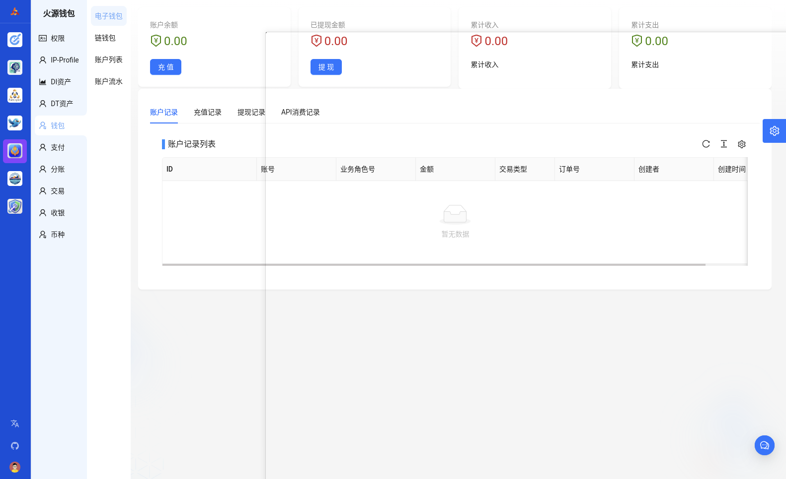
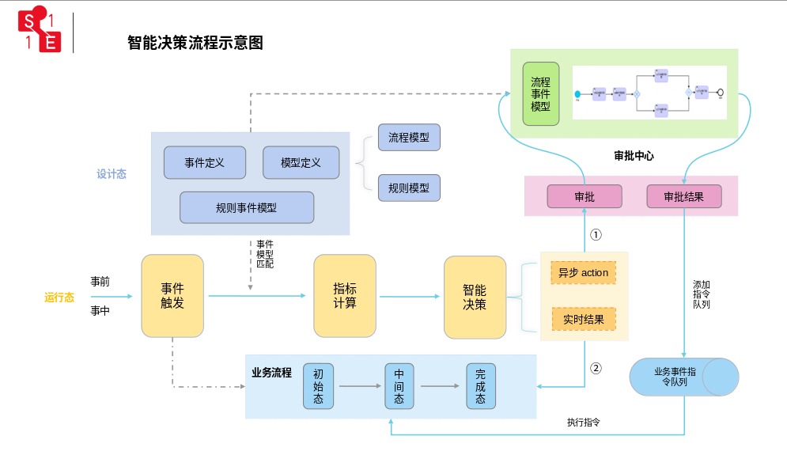

# 企业级的MPC区块链钱包

火源钱包(Bsin-s11e-wallet)是一款基于[BsinPaaS开源框架](https://gitee.com/s11e-DAO/bsin-paas-all-in-one)架构设计的企业级MPC区块链钱包。以WaaS（Wallet as a Service）为核心理念，旨在为企业提供强大的Web3资产管理能力，确保资产的安全控制和流畅转移。

一、火源钱包设计方案

1.1 架构设计
火源钱包采用先进的前后端分离、容器化微服务架构设计，支持WaaS服务，旨在确保Web3资产的安全控制和转移。

1.2 功能设计
- 身份管理：提供安全的身份验证和管理功能。
- 多链管理：支持多链资产管理，实现跨链资产自由流通。
- 资产管理：全面管理和监控用户的数字资产。
- 交易：安全、高效地处理资产交易。
- DApp应用接入：开放API，支持与各类DApp应用实现无缝对接。

1.3 用户界面

简洁、一致、流畅的界面设计和交互体验，使用户能够轻松、直观地管理和操作资产。

1.4 私钥管理
- 采用本地加密、分片存储、多签认证和社交恢复等先进技术，确保私钥安全可靠。

1.5 跨链支持
- 应用Polkadot、Cosmos等跨链技术，实现不同区块链资产的互操作性，提升资产灵活性和使用效率。

1.6 DApp应用
- 开放API接口，支持与多样化的DApp应用无缝对接，拓展用户的应用场景和选择余地。

1.7 安全机制
- 采用密码学算法、硬件安全模块、开源代码审计和Bug赏金计划等多重安全措施，保障用户资产的安全性和系统的可信度。

1.8 运维部署
- 通过Kubernetes集群管理、监控报警、灰度发布和流量管理等先进技术手段，确保系统的高可用性和稳定性。
作为安全多方计算（MPC）方案的一部分，门限签名方案（TSS）用于分布式密钥生成和签名，支持多方共同管理私钥，实现安全的资产管理和转移策略。

1.9 WaaS服务（Wallet as a Service）
- WaaS服务旨在让用户安全地控制和转移Web3资产，提供免私钥、免gas费用的用户体验，吸引更多传统Web2用户的参与和转移。
  

二、发展规划

- 火源钱包将秉承开放、安全、互操作的原则进行建设，鼓励开发者积极贡献代码和反馈意见。发展规划如下：
1. 第一阶段：完成基础产品开发和小规模公测，验证核心功能和安全性。
2. 第二阶段：增加功能模块，扩展用户基础，提升产品的市场适配度和用户体验。
3. 第三阶段：支持更多公链和资产类型，积极扩展和丰富DApp生态系统。
4. 第四阶段：建立开放、安全的Web3钱包标准，为整个区块链行业提供稳定、可靠的服务和技术支持。

三、业务设计
* 平台不能直接发行数字积分，需要通过平台直属商户发行

## 技术交流

加微信小助手入群

