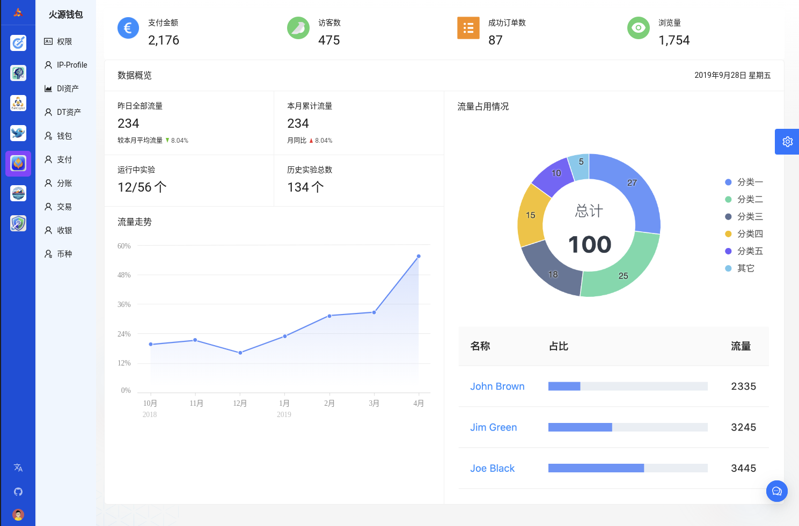

# 火源钱包-企业级的MPC区块链钱包

火源钱包
火源钱包是一款采用先进的前后端分离和云原生微服务架构设计的企业级MPC区块链钱包。以WaaS（Wallet as a Service）为核心理念，旨在为企业提供强大的Web3资产管理能力，确保资产的安全控制和流畅转移。该钱包不仅支持多链管理和高级加密算法，还优化了用户体验和操作便捷性，为企业用户和个人投资者提供了一体化、安全可靠的数字资产管理解决方案。

一、Web3钱包分类
在Web3的基础上，Web3钱包是用于存储代币、NFT等数字资产的数字钱包，具备发送和接收数字资产、以个人凭证登录Web3应用和DApp的功能。主流的Web3钱包包括HD钱包、CA钱包、TBAERC-6551和MPC等。
主流Web3钱包分类
- HD钱包（Hierarchical Deterministic Wallet）：通过树状结构管理私钥，提供更安全的资产管理和备份机制。
- CA钱包（Cryptographic Accumulators Wallet）：利用累加器结构提高交易效率和数据验证速度。
- TBAERC-6551：新一代的实体商业会员卡钱包，整合身份验证和资产管理功能。
- MPC（Multi-Party Computation）：采用安全多方计算技术，实现多重签名和私钥管理，提升安全性和用户控制权。

二、Web3钱包设计方案

2.1 架构设计
火源钱包采用先进的前后端分离、容器化微服务架构设计，支持WaaS服务，旨在确保Web3资产的安全控制和转移。

2.2 功能设计
- 身份管理：提供安全的身份验证和管理功能。
- 多链管理：支持多链资产管理，实现跨链资产自由流通。
- 资产管理：全面管理和监控用户的数字资产。
- 交易：安全、高效地处理资产交易。
- DApp应用接入：开放API，支持与各类DApp应用实现无缝对接。

2.3 用户界面

简洁、一致、流畅的界面设计和交互体验，使用户能够轻松、直观地管理和操作资产。

2.4 私钥管理
- 采用本地加密、分片存储、多签认证和社交恢复等先进技术，确保私钥安全可靠。

2.5 跨链支持
- 应用Polkadot、Cosmos等跨链技术，实现不同区块链资产的互操作性，提升资产灵活性和使用效率。

2.6 DApp应用
- 开放API接口，支持与多样化的DApp应用无缝对接，拓展用户的应用场景和选择余地。

2.7 安全机制
- 采用密码学算法、硬件安全模块、开源代码审计和Bug赏金计划等多重安全措施，保障用户资产的安全性和系统的可信度。

2.8 运维部署
- 通过Kubernetes集群管理、监控报警、灰度发布和流量管理等先进技术手段，确保系统的高可用性和稳定性。
作为安全多方计算（MPC）方案的一部分，门限签名方案（TSS）用于分布式密钥生成和签名，支持多方共同管理私钥，实现安全的资产管理和转移策略。

2.9 WaaS服务（Wallet as a Service）
- WaaS服务旨在让用户安全地控制和转移Web3资产，提供免私钥、免gas费用的用户体验，吸引更多传统Web2用户的参与和转移。
  

三、发展规划

- 火源钱包将秉承开放、安全、互操作的原则进行建设，鼓励开发者积极贡献代码和反馈意见。发展规划如下：
1. 第一阶段：完成基础产品开发和小规模公测，验证核心功能和安全性。
2. 第二阶段：增加功能模块，扩展用户基础，提升产品的市场适配度和用户体验。
3. 第三阶段：支持更多公链和资产类型，积极扩展和丰富DApp生态系统。
4. 第四阶段：建立开放、安全的Web3钱包标准，为整个区块链行业提供稳定、可靠的服务和技术支持。