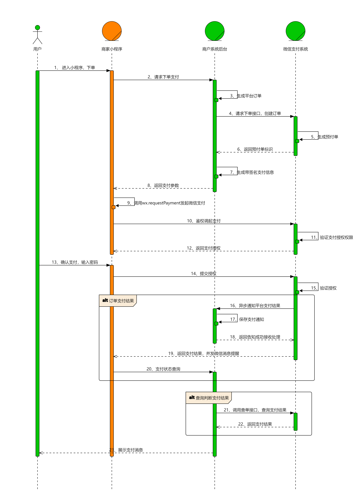

## 支付通道
- 微信支付
- 支付宝
- 云闪付 
- 盛付通
- 京东支付
- 农业银行

## 支付方式
- WX_H5("WX_H5", "微信H5")
- WX_JSAPI("WX_JSAPI", "微信公众号")
- WX_LITE("WX_LITE", "微信小程序")
- WX_NATIVE("WX_NATIVE", "微信扫码")
- WX_BAR("WX_BAR", "微信条码")
- WX_APP("WX_APP", "微信APP")
- WX("WX", "微信")
- ALI("ALI", "支付宝支付")
- ALI_APP("ALI_APP", "支付宝App")
- ALI_BAR("ALI_BAR", "支付宝条码")
- ALI_JSAPI("WX_JSAPI", "支付宝生活号")
- ALI_LITE("ALI_LITE", "支付宝小程序")
- ALI_PC("ALI_PC", "支付宝PC网站")
- ALI_QR("ALI_QR", "支付宝二维码")
- ALI_WAP("ALI_WAP", "支付宝WAP")
- XLALILITE("XLALILITE", "信联支付宝支付")
- YSF_BAR("YSF_BAR", "云闪付条码")
- YSF_JSAPI("YSF_JSAPI", "云闪付jsapi")
- YSF_LITE("YSF_LITE", "云闪付小程序")
- UP_QR("UP_QR", "银联二维码(主扫)")
- UP_BAR("UP_BAR", "银联二维码(被扫)")
- UP_APP("UP_APP", "银联App支付")
- QR_CASHIER("QR_CASHIER", "聚合")
- QQ_PAY("QQ_PAY", "钱包")
- PP_PC("PP_PC", "PayPal支付")
- ICBC_APP("ICBC_APP", "工行APP支付")
- 
### [微信支付通道](https://pay.weixin.qq.com/docs/merchant/products/jsapi-payment/introduction.html)

#### [WX_LITE(微信小程序支付)](https://pay.weixin.qq.com/docs/merchant/products/mini-program-payment/introduction.html)
商户已有微信小程序，用户通过好友分享或扫描二维码在微信内打开小程序时，可以调用微信支付完成下单购买的流程
意：小程序不能通过拉起H5页面做jsapi支付，小程序内只能使用小程序支付
- 接入前准备
>* 选择接入模式： 普通商户 | 普通服务商
- 参数
>*  merchantId： 微信支付商户号
>*  商户 API 证书： 指由商户申请的，包含证书序列号、商户的商户号、公司名称、公钥信息的证书
>*  privateKeyPath：商户API私钥路径，商户申请商户API证书时，会生成商户私钥，并保存在本地证书文件夹的文件 apiclient_key.pem 中。
>*  merchantSerialNumber： 商户证书序列号，
>*  apiV3Key：商户APIV3密钥，为了保证安全性，微信支付在回调通知和平台证书下载接口中，对关键信息进行了 AES-256-GCM 加密。APIv3 密钥是加密时使用的对称密钥

- 快速接入

商户系统先调用该接口在微信支付服务后台生成预支付交易单，返回正确的预支付交易会话标识后再按Native、JSAPI、APP等不同场景生成交易串调起支付。  
重点步骤说明：  
步骤4： 用户下单发起支付，商户可通过JSAPI下单创建支付订单。   
步骤9： 商户小程序内使用小程序调起支付API（wx.requestPayment）发起微信支付，详见小程序API文档 (opens new window)。  
步骤16： 用户支付成功后，商户可接收到微信支付支付结果通知支付通知API。  
步骤21： 商户在没有接收到微信支付结果通知的情况下需要主动调用查询订单API查询支付结果。  
~~~bash
curl -X POST \
  https://api.mch.weixin.qq.com/v3/pay/transactions/jsapi \
  -H "Authorization: WECHATPAY2-SHA256-RSA2048 mchid=\"1900000001\",..." \
  -H "Accept: application/json" \
  -H "Content-Type: application/json" \
  -d '{
    "appid" : "wxd678efh567hg6787",
    "mchid" : "1230000109",
    "description" : "Image形象店-深圳腾大-QQ公仔",
    "out_trade_no" : "1217752501201407033233368018",
    "time_expire" : "2018-06-08T10:34:56+08:00",
    "attach" : "自定义数据说明",
    "notify_url" : " https://www.weixin.qq.com/wxpay/pay.php",
    "goods_tag" : "WXG",
    "support_fapiao" : true,
    "amount" : {
      "total" : 100,
      "currency" : "CNY"
    },
    "payer" : {
      "openid" : "oUpF8uMuAJO_M2pxb1Q9zNjWeS6o\t"
    },
    "detail" : {
      "cost_price" : 608800,
      "invoice_id" : "微信123",
      "goods_detail" : [
        {
          "merchant_goods_id" : "1246464644",
          "wechatpay_goods_id" : "1001",
          "goods_name" : "iPhoneX 256G",
          "quantity" : 1,
          "unit_price" : 528800
        }
      ]
    },
    "scene_info" : {
      "payer_client_ip" : "14.23.150.211",
      "device_id" : "013467007045764",
      "store_info" : {
        "id" : "0001",
        "name" : "腾讯大厦分店",
        "area_code" : "440305",
        "address" : "广东省深圳市南山区科技中一道10000号"
      }
    },
    "settle_info" : {
      "profit_sharing" : false
    }
  }'
# 应答
{
  "prepay_id" : "wx201410272009395522657a690389285100"
}

~~~

>* 【服务端】小程序下单  
重要入参说明：
out_trade_no： 商户系统内部订单号，只能是数字、大小写字母_-*且在同一个商户号下唯一。
description： 商品描述。
notify_url： 支付回调通知URL，该地址必须为直接可访问的URL，不允许携带查询串。
total： 订单总金额，单位为分。
OpenID： OpenID是微信用户在AppID下的唯一用户标识（AppID不同，则获取到的OpenID就不同），可用于永久标记一个用户。OpenID获取方式请参考以下文档小程序获取OpenID (opens new window)、公众号获取OpenID (opens new window)、App获取OpenID (opens new window)。
更多参数、响应详情及错误码请参见JSAPI下单接口文档。
 
>* 【客户端】小程序调起支付API
步骤说明： 通过JSAPI下单API成功获取预支付交易会话标识（prepay_id） 后，需要通过JSAPI调起支付API来调起微信支付收银台。
 重要入参说明：
package： JSAPI下单接口返回的prepay_id参数值，提交格式如：prepay_id=***。
signType： 该接口V3版本仅支持RSA。
paySign： 签名。
paySign生成规则、响应详情及错误码请参见 小程序调起支付接口文档。

>* 【服务端】接收支付结果通知
步骤说明： 当用户完成支付，微信会把相关支付结果将通过异步回调的方式通知商户，商户需要接收处理，并按文档规范返回应答

>* 【服务端】查询订单
步骤说明： 当商户后台、网络、服务器等出现异常，商户系统最终未接收到支付通知时，商户可通过查询订单接口核实订单支付状态。

>* 【服务端】关闭订单
步骤说明： 当商户订单支付失败需要生成新单号重新发起支付，要对原订单号调用关单，避免重复支付；系统下单后，用户支付超时，系统退出不再受理，避免用户继续，请调用关单接口。

>*【服务端】申请交易账单
步骤说明： 微信支付按天提供交易账单文件，商户可以通过该接口获取账单文件的下载地址。
> 
>* 【服务端】下载账单
步骤说明： 申请交易账单接口获取到账单下载地址（download_url）后，再通过该接口获取到对应的账单文件，文件内包含交易相关的金额、时间、营销等信息，供商户核对订单、退款、银行到账等情况。
> 

- 服务器配置要求
>* 程序访问商户服务都是通过HTTPS,开发部署的时候需要HTTPS服务器
>* 服务器域名配置:小程序只可以跟指定的域名进行网络通信

#### WX_JSAPI(微信小程序支付)
JSAPI支付是指商户通过调用微信支付提供的JSAPI接口，在支付场景中调起微信支付模块完成收款。 JSAPI支付适用于线下场所、公众号场景和PC网站场景。
- 参数配置